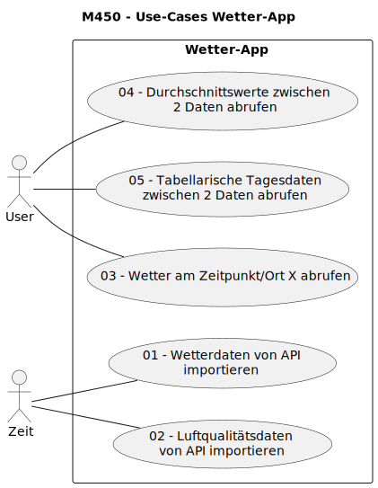

# M450 - Use-Cases für Wetter-Applikation

Im Folgenden sind die Anforderungen an die gewünschte Wetter-Applikation
in Form von Use-Cases / Use-Case-Beschreibungen notiert.

- [Use-Case-Beschreibungen](#use-case-beschreibungen)
	- [01 - Wetterdaten von API importieren](#01-wetterdaten-von-api-importieren)
		- [Essentielle Schritte](#essentielle-schritte)
		- [Erweiterungen](#erweiterungen)
	- [02 - Luftqualitätsdaten von API importieren](#02-luftqualitätsdaten-von-api-importieren)
		- [Essentielle Schritte](#essentielle-schritte-1)
		- [Erweiterungen](#erweiterungen-1)
	- [03 - Wetter am Zeitpunkt/Ort X abrufen](#03-wetter-am-zeitpunktort-x-abrufen)
		- [Essentielle Schritte](#essentielle-schritte-2)
		- [Erweiterungen](#erweiterungen-2)
	- [04 - Durchschnittswerte zwischen 2 Daten abrufen](#04-durchschnittswerte-zwischen-2-daten-abrufen)
		- [Essentielle Schritte](#essentielle-schritte-3)
		- [Erweiterungen](#erweiterungen-3)

--- 

## Use-Case-Beschreibungen

### 01 - Wetterdaten von API importieren

|                   |                                                                                                                              |
| ----------------- | ---------------------------------------------------------------------------------------------------------------------------- |
| **Ziel**          | Ein Datenpunkt mit den aktuellen Wetterdaten ist in der Datenbank-Tabelle `weather` gespeichert.                             |
| **Akteure**       | Zeit, User                                                                                                                   |
| **Auslöser**      | * Zeit: der Vorgang wird zeitgesteuert / periodisch ausgelöst  * User: der Benutzer löst den Vorgang manuell einmalig aus |
| **Nachbedingung** | Die Tabelle `weather` enthält einen neuen Eintrag mit den aktuellen Daten für den Ort.                                       |

#### Essentielle Schritte

1. Ein Benutzer oder ein zeitgesteuerter Prozess stösst das Wetter-Import-Script an (Konsole)
2. Als Input-Parameter wird eine Postleitzahl mitgegeben
3. Das Script holt sich die aktuellen Wetterdaten von https://api.openweathermap.org/data/2.5/weather
   zu dieser PLZ
4. Das Script parst die Daten und speichert die Werte in der Tabelle `weather`.
5. Folgende Werte werden festgehalten:
	* Zeitstempel der Messung
	* Land
	* PLZ, Ort
	* Koordinaten
	* Wetter-Beschreibung
	* Icon
	* Temperatur aktuell, Tages-Minimum/Maximum
	* gefühlte Temperatur
	* Luftdruck, Luftfeuchtigkeit
	* Angaben zum Wind
	* Sonnen-Auf- und Untergangszeit

#### Erweiterungen

2a. Es wird kein Input-Parameter mitgegeben: Der Import bricht mit einem Fehler ab.

3a. Die API kann nicht abgefragt werden: Der Import bricht mit einem Fehler ab.

---

### 02 - Luftqualitätsdaten von API importieren

|                   |                                                                                                                              |
| ----------------- | ---------------------------------------------------------------------------------------------------------------------------- |
| **Ziel**          | Ein Datenpunkt mit den aktuellen Luftqualitätsdaten ist in der Datenbank-Tabelle `air_quality` gespeichert.                  |
| **Akteure**       | Zeit, User                                                                                                                   |
| **Auslöser**      | * Zeit: der Vorgang wird zeitgesteuert / periodisch ausgelöst  * User: der Benutzer löst den Vorgang manuell einmalig aus |
| **Nachbedingung** | Die Tabelle `air_quality` enthält einen neuen Eintrag mit den aktuellen Daten für den Ort.                                   |

#### Essentielle Schritte

1. Ein Benutzer oder ein zeitgesteuerter Prozess stösst das Import-Script an (Konsole)
2. Als Input-Parameter wird eine Postleitzahl mitgegeben
3. Das Script holt sich die aktuellen Luftqualitätsdaten von http://api.openweathermap.org/data/2.5/air_pollution
   zu dieser PLZ
4. Das Script parst die Daten und speichert die Werte in der Tabelle `air_quality`.
5. Folgende Werte werden festgehalten:
	* Zeitstempel der Messung
	* Land
	* PLZ, Ort
	* Luftqualitäts-Index
	* Partikelzahlen (ug/m3) für:
    	* CO
    	* NO
    	* NO2
    	* O3
    	* SO2
    	* PM2_5
    	* PM10
    	* NH3

#### Erweiterungen

2a. Es wird kein Input-Parameter mitgegeben: Der Import bricht mit einem Fehler ab.

3a. Die API kann nicht abgefragt werden: Der Import bricht mit einem Fehler ab.

--- 

### 03 - Wetter am Zeitpunkt/Ort X abrufen
|                   |                                                                                                     |
| ----------------- | --------------------------------------------------------------------------------------------------- |
| **Ziel**          | Der User sieht auf einer Webseite die Wetter- und Luftqualitätsdaten für einen bestimmten Zeitpunkt |
| **Akteure**       | User                                                                                                |
| **Auslöser**      | Der Benutzer ruft die Wetter-Infoseite auf                                                          |
| **Nachbedingung** | -                                                                                                   |

#### Essentielle Schritte

1. Der Benutzer ruft die Daten-Abrufseite auf.
2. Der Benutzer wählt den Ort (PLZ) aus einer vorgefertigten Liste aus
3. Der Benutzer wählt ein Datum und eine Zeit
4. Der Benutzer klickt auf "Daten laden" (o.ä.)
5. Die Webseite fragt die Daten vom Server ab und stellt die Daten
   für den gewählten Zeitpunkt tabellarisch dar. Es werden sowohl
   Wetter- wie auch Luftqualitätsdaten ausgegeben, und zwar folgende Werte: 
   **Wetter**: 
	* Zeitstempel der Messung
	* Land
	* PLZ, Ort
	* Koordinaten
	* Wetter-Beschreibung, auf Deutsch
	* Icon
	* Temperatur aktuell, Tages-Minimum/Maximum, in °C **und** in °F
	* gefühlte Temperatur, in °C **und** in °F
	* Luftdruck, Luftfeuchtigkeit
	* Angaben zum Wind
	* Sonnen-Auf- und Untergangszeit

   **Luft:** 
	* Zeitstempel der Messung
	* Land
	* PLZ, Ort
	* Luftqualitäts-Index
	* Partikelzahlen (ug/m3) für:
    	* CO
    	* NO
    	* NO2
    	* O3
    	* SO2
    	* PM2_5
    	* PM10
    	* NH3

#### Erweiterungen

3a. Der Benutzer wählt kein Datum/Zeit: Als Vorgabe ist das aktuelle Datum / die aktuelle Zeit abgefüllt.

5a. Für den gewählten Zeitpunkt (+/- 30min) sind keine Wetter- und/oder Luft-Daten vorhanden. Die Webseite zeigt dies mit einer Fehlermeldung an.

---

### 04 - Durchschnittswerte zwischen 2 Daten abrufen

|                   |                                                                                                     |
| ----------------- | --------------------------------------------------------------------------------------------------- |
| **Ziel**          | Der User sieht auf einer Webseite die Durchschnitts-Wetter- und Luftqualitätsdaten über einen definierten Zeitraum |
| **Akteure**       | User                                                                                                |
| **Auslöser**      | Der Benutzer ruft die Wetter-Durchschnitts-Seite auf                                                          |
| **Nachbedingung** | -                                                                                                   |

#### Essentielle Schritte

1. Der Benutzer ruft die Durchschnitts-Daten-Abrufseite auf.
2. Der Benutzer wählt den Ort (PLZ) aus einer vorgefertigten Liste aus
3. Der Benutzer wählt ein Start-Datum und eine Zeit
4. Der Benutzer wählt ein End-Datum und eine Zeit
5. Der Benutzer klickt auf "Daten laden" (o.ä.)
6. Die Webseite fragt die Daten vom Server ab und stellt die Daten
   für den gewählten Zeitraum tabellarisch dar. Es werden Durchschnittswerte im gewählten Zeitraum von sowohl Wetter- wie auch Luftqualitätsdaten ausgegeben, und zwar folgende Werte: 
   **Wetter**: 
	* Zeitraum der Messungen
	* Land
	* PLZ, Ort
	* Koordinaten
	* Temperatur-Schnitt, in °C **und** in °F
	* gefühlte Temperatur, in °C **und** in °F
	* Luftdruck, Luftfeuchtigkeit
	* Angaben zum Wind

   **Luft:** 
	* Zeitstempel der Messung
	* Land
	* PLZ, Ort
	* Partikelzahlen (ug/m3) für:
    	* CO
    	* NO
    	* NO2
    	* O3
    	* SO2
    	* PM2_5
    	* PM10
    	* NH3

#### Erweiterungen

6a. Für den gewählten Zeitpunkt sind keine Wetter- und/oder Luft-Daten vorhanden. Die Webseite zeigt dies mit einer Fehlermeldung an.